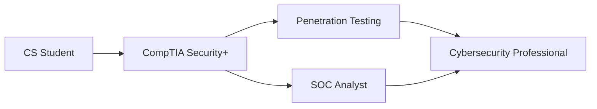

# Hi there 👋 

<div align="center">
  
[](https://git.io/typing-svg)

</div>

## About Me

Third-year Computer Science student at Interamerican University of Puerto Rico, currently pursuing CompTIA Security+ certification. Aspiring cybersecurity professional with focus on network security, penetration testing, and incident response. Based in Puerto Rico and open to work opportunities.

## Current Focus

```yaml
Learning & Certification:
  - CompTIA Security+ Certification (Expected October 2024)
  - Building Virtual Home Lab for cybersecurity practice
  - Linux system administration
  - Secure web application development
```

## Tech Stack & Tools

<div align="center">

### Languages & Frameworks


### Tools & Technologies


</div>

## Certifications & Learning Path



## Connect with Me 🤝

<div align="left">

**LinkedIn** [abdiel-vega2004](https://www.linkedin.com/in/abdiel-vega2004)  
**Email:** abdiel.vega@outlook.com  
**Phone:** (787)-949-5751  

</div>
