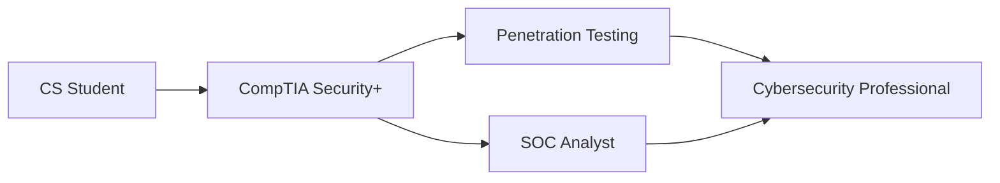

# Hi there, I'm Abdiel Vega

  

## About Me

**Third-year Computer Science student** at Interamerican University of Puerto Rico  
**Aspiring Cybersecurity Professional** | Currently pursuing CompTIA Security+  
Building expertise in Network Security, Penetration Testing, and Incident Response  
Based in Puerto Rico | Open to work opportunities

## Current Focus

- CompTIA Security+ Certification (Expected October 2024)
- Building a Virtual Home Lab for cybersecurity practice
- Mastering Linux system administration
- Developing secure web applications

## Tech Stack & Tools

### Languages & Frameworks

### Tools & Technologies

## Certifications & Learning Path

## Connect

---

*"Security is not a product, but a process"* - Bruce Schneier

### 🔐 "Security is not a product, but a process" - Bruce Schneier

