# Hi there, I'm Abdiel Vega! 👋

<div align="center">
  
[](https://git.io/typing-svg)

</div>


## 🛡️ About Me

- 🎓 **Third-year Computer Science student** at Interamerican University of Puerto Rico
- 🔒 **Aspiring Cybersecurity Professional** | Currently pursuing CompTIA Security+
- 🌱 Building expertise in **Network Security**, **Penetration Testing**, and **Incident Response**
- 🏠 Based in **Puerto Rico** | Open to work opportunities
- ⚡ Passionate about creating secure, robust applications and systems

<br clear="right"/>

## 🚀 What I'm Currently Working On

```yaml
Current Focus:
  - 🏆 CompTIA Security+ Certification (Expected October 2024)
  - 🏠 Building a Virtual Home Lab for cybersecurity practice
  - 🐧 Mastering Linux system administration
  - 🌐 Developing secure web applications
```

## 🛠️ Tech Stack & Tools

<div align="center">

### Languages & Frameworks


### Tools & Technologies


### Cybersecurity Focus Areas


</div>

## 📊 Featured Projects

<div align="center">

| Project | Description | Tech Stack |
|---------|-------------|------------|
| 🍳 **I-Cooked Recipe Website** | Full-stack application with secure authentication | TypeScript, Authentication |
| 🏠 **Cybersecurity Home Lab** | Virtual environment for security testing & learning | VirtualBox, Linux, Network Tools |

</div>

## 📈 GitHub Analytics

<div align="center">
  


</div>

<div align="center">
  
[](https://git.io/streak-stats)

</div>

## 🏆 Certifications & Learning Path

```mermaid
graph LR
    A[🎓 CS Student] --> B[📚 CompTIA Security+]
    B --> C[🔍 Penetration Testing]
    B --> D[🛡️ SOC Analyst]
    C --> E[💼 Cybersecurity Professional]
    D --> E
```



## 🤝 Let's Connect!

<div align="center">

[](https://www.linkedin.com/in/abdiel-vega2004)
[](mailto:your-email@example.com)
[](https://github.com/abdiel-vega)

</div>

---

<div align="center">

### 🔐 "Security is not a product, but a process" - Bruce Schneier


</div>
